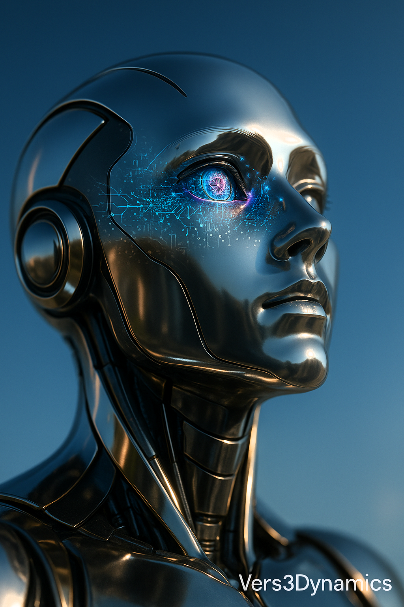

# Non-Hermitian Quantum Scrambling

A real-time visualization of non-Hermitian quantum information scrambling, featuring interactive controls and dynamic particle effects. Built with a minimal, ambient sci-fi aesthetic inspired by neural networks, cymatic mandalas, and biofeedback loops.



## 🌌 Overview

This web application simulates and visualizes quantum information scrambling in non-Hermitian systems, where gain and loss mechanisms create fascinating dynamics. Watch as quantum states evolve, interfere, and scramble across multiple sites in real-time.

## ✨ Features

- **Real-time Quantum Simulation**: Live visualization of quantum state evolution
- **Interactive Controls**: Adjust system parameters on the fly
  - Number of quantum sites (2-12)
  - Coupling strength (J)
  - Gain/Loss parameter (γ)
- **Dynamic Metrics**: Monitor entropy, participation ratio, and energy in real-time
- **Animated Particle Background**: Ambient visual effects with interconnected particles
- **Responsive Design**: Works seamlessly across desktop and mobile devices
- **Modern UI**: Clean, minimal interface with smooth animations

## 🚀 Technologies

- **React** - UI framework
- **TypeScript** - Type-safe development
- **Vite** - Fast build tool and dev server
- **Tailwind CSS** - Utility-first styling
- **Canvas API** - High-performance visualization
- **Inter Font** - Modern, clean typography

## 📦 Installation

```bash
# Clone the repository
git clone https://github.com/yourusername/non-hermitian-quantum-scrambling.git

# Navigate to project directory
cd non-hermitian-quantum-scrambling

# Install dependencies
npm install

# Start development server
npm run dev
```

## 🎮 Usage

1. **Start/Pause Simulation**: Click the play/pause button to control the simulation
2. **Adjust Sites**: Use the slider to change the number of quantum sites (2-12)
3. **Modify Coupling (J)**: Control the interaction strength between sites
4. **Set Gain/Loss (γ)**: Adjust non-Hermitian effects (gain > 0, loss < 0)
5. **Reset**: Return to initial state at any time
6. **View Metrics**: Monitor entropy, participation ratio, and energy evolution

## 🔬 Physics Background

Non-Hermitian quantum systems exhibit unique properties due to gain and loss mechanisms. This simulation demonstrates:

- **Quantum Scrambling**: How information spreads across quantum sites
- **PT Symmetry**: Parity-time symmetric systems with balanced gain/loss
- **Exceptional Points**: Critical transitions in parameter space
- **Entanglement Dynamics**: Evolution of quantum correlations

## 🎨 Design Philosophy

The visual design draws inspiration from:
- Neural network connectivity patterns
- Cymatic mandala structures
- Biofeedback loop visualizations
- Minimal, ambient sci-fi aesthetics

## 🛠️ Development

```bash
# Run development server
npm run dev

# Build for production
npm run build

# Preview production build
npm run preview
```

## 📝 License

MIT License - feel free to use this project for learning and experimentation.

## 🙏 Credits

Developed with [Vers3Dynamics](https://vers3dynamics.com) 

---

**Vers3Dynamics** - Exploring the frontiers of quantum information
